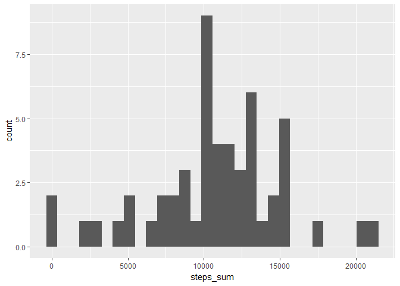
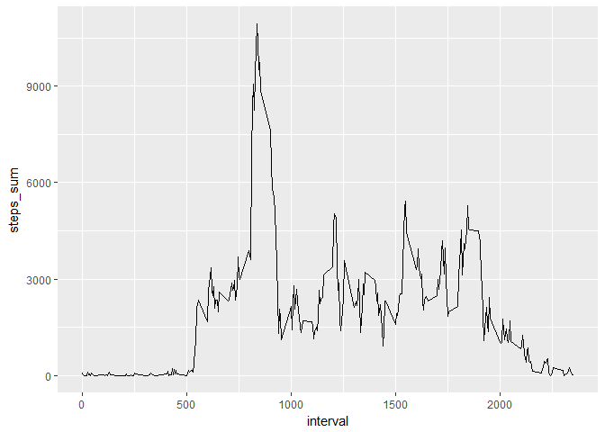
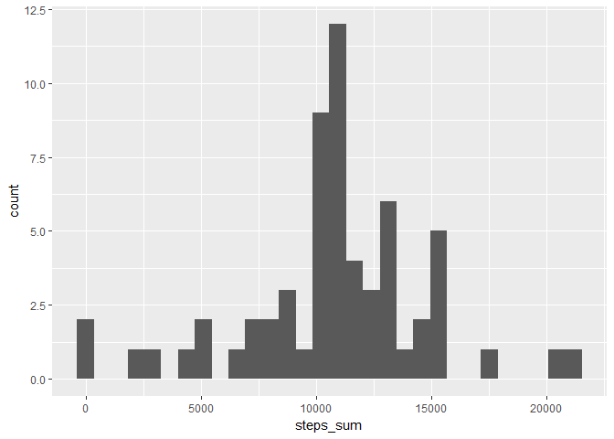
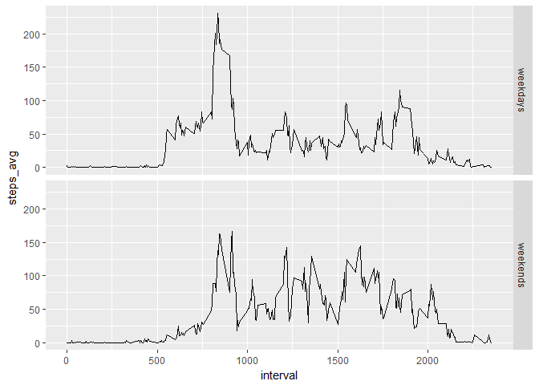

This assignment involves exploratory data analysis on data from a
personal activity monitoring device, and presentation of analysis and
results using R markdown.

#### First load required Libraries

    library (dplyr)
    library (ggplot2)

### 1. Code for reading in the dataset and/or processing the data

Unzip and then read the datafile using read.csv.

    unzip ("activity.zip")
    a <- read.csv("activity.csv")

Create a copy of data ommiting NA Values.

    a1 <- na.omit(a)

### 2. Histogram of the total number of steps taken each day

I use dplyr functions to group by and summarize data by date and ggplot2
package to draw histogram.

    a1_date <-group_by(a1, date) 
    a1_sum_date <- summarise(a1_date, steps_sum = sum( steps))
    qplot(steps_sum,  data=a1_sum_date)

    ## `stat_bin()` using `bins = 30`. Pick better value with `binwidth`.

### 3. Mean and median number of steps taken each day

Calling summary on summarized data per date will return mean and median
(among others)

    summary(a1_sum_date)

    ##          date      steps_sum    
    ##  2012-10-02: 1   Min.   :   41  
    ##  2012-10-03: 1   1st Qu.: 8841  
    ##  2012-10-04: 1   Median :10765  
    ##  2012-10-05: 1   Mean   :10766  
    ##  2012-10-06: 1   3rd Qu.:13294  
    ##  2012-10-07: 1   Max.   :21194  
    ##  (Other)   :47

### 4. Time series plot of the average number of steps taken

We will have to group by the 5 min intervals and summarize on steps and
then plot sum of steps by intervals.

    a1_5min <-group_by(a1, interval) 
    a1_sum_5min <- summarise(a1_5min, steps_sum = sum(steps))
    ggplot(data=a1_sum_5min, aes(x=interval, y=steps_sum)) + geom_line()

### 5. The 5-minute interval that, on average, contains the maximum number of steps

Get the row containing max steps (by 5min interval) and then select
interval column.

    a1_sum_5min[which.max(a1_sum_5min$steps_sum),]$interval

    ## [1] 835

### 6. Code to describe and show a strategy for imputing missing data

There are 2304 missing values from the dataset. (the number of missing
values is produced by the r code "sum(is.na(a$steps))")

Each NA in the steps valriable of the original dataset will be replaced
by the mean (of all days) of this 5 minute interval.

-   First calculate mean of all days for each interval.

<!-- -->

    a1_avg_5min <- summarise(a1_5min, steps_mean = mean(steps))

-   Then merge original data with mean data on interval

<!-- -->

    a_mean <- merge (a, a1_avg_5min, by="interval")

-   Then Create a column that when steps is NA replaces it with mean.
    And then leave out the speps\_mean column

<!-- -->

    a_mean <- mutate (a_mean, steps=ifelse(is.na(steps),steps_mean,steps ))

    ## Warning: package 'bindrcpp' was built under R version 3.4.4

    a_mean <- select (a_mean, interval:date)

### 7.Histogram of the total number of steps taken each day after missing values are imputed

    amean_date <-group_by(a_mean, date) 
    amean_sum_date <- summarise(amean_date, steps_sum = sum(steps))
    qplot(steps_sum,  data=amean_sum_date)

    ## `stat_bin()` using `bins = 30`. Pick better value with `binwidth`.

Calling summary on summarized data per date will return mean and median
(among others)

    summary(amean_sum_date)

    ##          date      steps_sum    
    ##  2012-10-01: 1   Min.   :   41  
    ##  2012-10-02: 1   1st Qu.: 9819  
    ##  2012-10-03: 1   Median :10766  
    ##  2012-10-04: 1   Mean   :10766  
    ##  2012-10-05: 1   3rd Qu.:12811  
    ##  2012-10-06: 1   Max.   :21194  
    ##  (Other)   :55

Comparing to the mean and median of the original data, there is only a
small change in median. Imputed dataset has median 10.766 instead of
10.765.

### 8.Panel plot comparing the average number of steps taken per 5-minute interval across weekdays and weekends

We are going to use the imputed dataset. First create a variable
day\_type separating weekdays from weekends:

    a_mean1 <- mutate (a_mean, day_type=ifelse(weekdays(as.Date(a_mean$date)) %in% c("Saturday","Sunday"),"weekends","weekdays" ))

Then we group by interval and day\_type and plot using ggplot and facets

    amean1_sum_5min <-a_mean1 %>% group_by( interval, day_type) %>%  summarise(steps_avg = mean(steps))
    ggplot(amean1_sum_5min, aes(x=interval, y=steps_avg)) + geom_line() + facet_grid(day_type ~ .)

